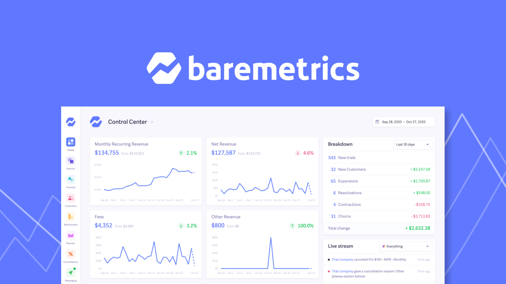

<div align="left">

[](https://baremetrics.com)

# [Baremetrics](https://baremetrics.com)

Baremetrics provides real-time subscription metrics for teams built with Stripe, Shopify Partners, Braintree, Recurly, Chargebee, Google Play, and App Store Connect. 

In addition to metrics, Baremetrics provides tools that help you reduce churn and grow your business faster: 

Recover: Prevent failed charges and keep your hard-earned revenue with our 100% automated toolkit. 

Cancellation insights: Learn exactly why your customers cancel, calculate lost revenue by cancellation reason, and send automated emails to win customers back.

Flightpath: Plan for the future with flexible financial modeling tools built for growing SaaS companies.

</div>

## Requirements

Building the API client library requires:

1. Java 1.8+
2. Maven (3.8.3+)/Gradle (7.2+)

If you are adding this library to an Android Application or Library:

3. Android 8.0+ (API Level 26+)

## Installation<a id="installation"></a>
<div align="center">
  <a href="https://konfigthis.com/sdk-sign-up?company=Baremetrics&language=Java">
    
  </a>
</div>

### Maven users

Add this dependency to your project's POM:

```xml
<dependency>
  <groupId>com.konfigthis</groupId>
  <artifactId>baremetrics-java-sdk</artifactId>
  <version>1.0</version>
  <scope>compile</scope>
</dependency>
```

### Gradle users

Add this dependency to your `build.gradle`:

```groovy
// build.gradle
repositories {
  mavenCentral()
}

dependencies {
   implementation "com.konfigthis:baremetrics-java-sdk:1.0"
}
```

### Android users

Make sure your `build.gradle` file as a `minSdk` version of at least 26:
```groovy
// build.gradle
android {
    defaultConfig {
        minSdk 26
    }
}
```

Also make sure your library or application has internet permissions in your `AndroidManifest.xml`:

```xml
<!--AndroidManifest.xml-->
<?xml version="1.0" encoding="utf-8"?>
<manifest xmlns:android="http://schemas.android.com/apk/res/android"
    xmlns:tools="http://schemas.android.com/tools">
    <uses-permission android:name="android.permission.INTERNET"/>
</manifest>
```

### Others

At first generate the JAR by executing:

```shell
mvn clean package
```

Then manually install the following JARs:

* `target/baremetrics-java-sdk-1.0.jar`
* `target/lib/*.jar`

## Getting Started

Please follow the [installation](#installation) instruction and execute the following Java code:

```java
import com.konfigthis.client.ApiClient;
import com.konfigthis.client.ApiException;
import com.konfigthis.client.ApiResponse;
import com.konfigthis.client.Baremetrics;
import com.konfigthis.client.Configuration;
import com.konfigthis.client.auth.*;
import com.konfigthis.client.model.*;
import com.konfigthis.client.api.AccountApi;
import java.util.List;
import java.util.Map;
import java.util.UUID;

public class Example {
  public static void main(String[] args) {
    Configuration configuration = new Configuration();
    configuration.host = "https://api.baremetrics.com";
    
    configuration.sec0  = "YOUR API KEY";
    Baremetrics client = new Baremetrics(configuration);
    try {
      String result = client
              .account
              .getDetails()
              .execute();
    } catch (ApiException e) {
      System.err.println("Exception when calling AccountApi#getDetails");
      System.err.println("Status code: " + e.getStatusCode());
      System.err.println("Reason: " + e.getResponseBody());
      System.err.println("Response headers: " + e.getResponseHeaders());
      e.printStackTrace();
    }

    // Use .executeWithHttpInfo() to retrieve HTTP Status Code, Headers and Request
    try {
      ApiResponse<String> response = client
              .account
              .getDetails()
              .executeWithHttpInfo();
      System.out.println(response.getResponseBody());
      System.out.println(response.getResponseHeaders());
      System.out.println(response.getStatusCode());
      System.out.println(response.getRoundTripTime());
      System.out.println(response.getRequest());
    } catch (ApiException e) {
      System.err.println("Exception when calling AccountApi#getDetails");
      System.err.println("Status code: " + e.getStatusCode());
      System.err.println("Reason: " + e.getResponseBody());
      System.err.println("Response headers: " + e.getResponseHeaders());
      e.printStackTrace();
    }
  }
}

```

## Documentation for API Endpoints

All URIs are relative to *https://api.baremetrics.com*

Class | Method | HTTP request | Description
------------ | ------------- | ------------- | -------------
*AccountApi* | [**getDetails**](docs/AccountApi.md#getDetails) | **GET** /v1/account | Get Account
*AnnotationApi* | [**createNew**](docs/AnnotationApi.md#createNew) | **POST** /v1/annotations | Create Annotation
*AnnotationApi* | [**getDetails**](docs/AnnotationApi.md#getDetails) | **GET** /v1/annotations/{id} | Show Annotation
*AnnotationApi* | [**list**](docs/AnnotationApi.md#list) | **GET** /v1/annotations | List Annotations
*AnnotationApi* | [**removeById**](docs/AnnotationApi.md#removeById) | **DELETE** /v1/annotations/{id} | Delete Annotation
*AttributeApi* | [**createField**](docs/AttributeApi.md#createField) | **POST** /v1/attributes/fields | Create Attribute Field
*AttributeApi* | [**getFields**](docs/AttributeApi.md#getFields) | **GET** /v1/attributes/fields | List Attribute Fields
*AttributeApi* | [**setProperties**](docs/AttributeApi.md#setProperties) | **POST** /v1/attributes | Set Attributes
*AttributeApi* | [**updateField**](docs/AttributeApi.md#updateField) | **PUT** /v1/attributes/fields/{id} | Update Attribute Field
*CancellationInsightApi* | [**createNewReason**](docs/CancellationInsightApi.md#createNewReason) | **POST** /v1/cancellation_insights/reasons | Create Reason
*EventApi* | [**createInsightEvent**](docs/EventApi.md#createInsightEvent) | **POST** /v1/cancellation_insights/events | Create Event
*EventApi* | [**getEventById**](docs/EventApi.md#getEventById) | **GET** /v1/cancellation_insights/events/{id} | Show Event
*EventApi* | [**listCancellationInsightEvents**](docs/EventApi.md#listCancellationInsightEvents) | **GET** /v1/cancellation_insights/events | List Events
*EventApi* | [**updateEventById**](docs/EventApi.md#updateEventById) | **PUT** /v1/cancellation_insights/events/{id} | Update Event
*GoalApi* | [**createNewGoal**](docs/GoalApi.md#createNewGoal) | **POST** /v1/goals | Create Goal
*GoalApi* | [**getById**](docs/GoalApi.md#getById) | **GET** /v1/goals/{id} | Show Goal
*GoalApi* | [**getList**](docs/GoalApi.md#getList) | **GET** /v1/goals | List Goals
*GoalApi* | [**remove**](docs/GoalApi.md#remove) | **DELETE** /v1/goals/{id} | Delete Goal
*MetricApi* | [**listCustomers**](docs/MetricApi.md#listCustomers) | **GET** /v1/metrics/{metric}/customers | Show Customers
*MetricApi* | [**showCohorts**](docs/MetricApi.md#showCohorts) | **GET** /v1/metrics/cohorts | Show Cohorts
*MetricApi* | [**showDetails**](docs/MetricApi.md#showDetails) | **GET** /v1/metrics/{metric} | Show Metric
*MetricApi* | [**showPlanBreakout**](docs/MetricApi.md#showPlanBreakout) | **GET** /v1/metrics/{metric}/plans | Show Plan Breakout
*MetricApi* | [**showSummary**](docs/MetricApi.md#showSummary) | **GET** /v1/metrics | Show Summary
*ReasonApi* | [**deleteById**](docs/ReasonApi.md#deleteById) | **DELETE** /v1/cancellation_insights/reasons/{id} | Delete Reason
*ReasonApi* | [**showDetails**](docs/ReasonApi.md#showDetails) | **GET** /v1/cancellation_insights/reasons/{id} | Show Reason
*ReasonApi* | [**updateReasonById**](docs/ReasonApi.md#updateReasonById) | **PUT** /v1/cancellation_insights/reasons/{id} | Update Reason
*SegmentApi* | [**createRequest**](docs/SegmentApi.md#createRequest) | **POST** /v1/segments | Create Segment
*SegmentApi* | [**findWithoutSave**](docs/SegmentApi.md#findWithoutSave) | **POST** /v1/segments/search | Search Segment
*SegmentApi* | [**getFields**](docs/SegmentApi.md#getFields) | **GET** /v1/segments/fields | List Fields
*SegmentApi* | [**listSegments**](docs/SegmentApi.md#listSegments) | **GET** /v1/segments | List Segments
*SegmentApi* | [**removeById**](docs/SegmentApi.md#removeById) | **DELETE** /v1/segments/{id} | Delete Segment
*SegmentApi* | [**showDetails**](docs/SegmentApi.md#showDetails) | **GET** /v1/segments/{id} | Show Segment
*SegmentApi* | [**updateById**](docs/SegmentApi.md#updateById) | **PUT** /v1/segments/{id} | Update Segment
*SourceApi* | [**cancelSubscription**](docs/SourceApi.md#cancelSubscription) | **PUT** /v1/{source_id}/subscriptions/{subscription_oid}/cancel | Cancel Subscription
*SourceApi* | [**createChargeOneOff**](docs/SourceApi.md#createChargeOneOff) | **POST** /v1/{source_id}/charges | Create Charge
*SourceApi* | [**createCustomerRecord**](docs/SourceApi.md#createCustomerRecord) | **POST** /v1/{source_id}/customers | Create Customer
*SourceApi* | [**createOneOffRefund**](docs/SourceApi.md#createOneOffRefund) | **POST** /v1/{source_id}/refunds | Create Refund
*SourceApi* | [**createPlan**](docs/SourceApi.md#createPlan) | **POST** /v1/{source_id}/plans | Create Plan
*SourceApi* | [**createSubscription**](docs/SourceApi.md#createSubscription) | **POST** /v1/{source_id}/subscriptions | Create Subscription
*SourceApi* | [**deleteCustomer**](docs/SourceApi.md#deleteCustomer) | **DELETE** /v1/{source_id}/customers/{oid} | Delete Customer
*SourceApi* | [**deletePlan**](docs/SourceApi.md#deletePlan) | **DELETE** /v1/{source_id}/plans/{oid} | Delete Plan
*SourceApi* | [**getChargeDetails**](docs/SourceApi.md#getChargeDetails) | **GET** /v1/{source_id}/charges/{oid} | Show Charge
*SourceApi* | [**getChargeList**](docs/SourceApi.md#getChargeList) | **GET** /v1/{source_id}/charges | List Charges
*SourceApi* | [**getCustomerDetails**](docs/SourceApi.md#getCustomerDetails) | **GET** /v1/{source_id}/customers/{oid} | Show Customer
*SourceApi* | [**getCustomerList**](docs/SourceApi.md#getCustomerList) | **GET** /v1/{source_id}/customers | List Customers
*SourceApi* | [**getEventById**](docs/SourceApi.md#getEventById) | **GET** /v1/{source_id}/events/{id} | Show Event
*SourceApi* | [**getEvents**](docs/SourceApi.md#getEvents) | **GET** /v1/{source_id}/events | List Events
*SourceApi* | [**getPlan**](docs/SourceApi.md#getPlan) | **GET** /v1/{source_id}/plans/{oid} | Show Plan
*SourceApi* | [**getPlansList**](docs/SourceApi.md#getPlansList) | **GET** /v1/{source_id}/plans | List Plans
*SourceApi* | [**getRefundDetails**](docs/SourceApi.md#getRefundDetails) | **GET** /v1/{source_id}/refunds/{oid} | Show Refund
*SourceApi* | [**getRefunds**](docs/SourceApi.md#getRefunds) | **GET** /v1/{source_id}/refunds | List Refunds
*SourceApi* | [**getSubscription**](docs/SourceApi.md#getSubscription) | **GET** /v1/{source_id}/subscriptions/{oid} | Show Subscription
*SourceApi* | [**getSubscriptions**](docs/SourceApi.md#getSubscriptions) | **GET** /v1/{source_id}/subscriptions | List Subscriptions
*SourceApi* | [**listCustomerEvents**](docs/SourceApi.md#listCustomerEvents) | **GET** /v1/{source_id}/customers/{oid}/events | List Customer Events
*SourceApi* | [**listSources**](docs/SourceApi.md#listSources) | **GET** /v1/sources | List Sources
*SourceApi* | [**removeOneOffCharge**](docs/SourceApi.md#removeOneOffCharge) | **DELETE** /v1/{source_id}/charges/{oid} | Delete Charge
*SourceApi* | [**removeOneOffRefund**](docs/SourceApi.md#removeOneOffRefund) | **DELETE** /v1/{source_id}/refunds/{oid} | Delete Refund
*SourceApi* | [**removeSubscription**](docs/SourceApi.md#removeSubscription) | **DELETE** /v1/{source_id}/subscriptions/{oid} | Delete Subscription
*SourceApi* | [**updateCustomerInformation**](docs/SourceApi.md#updateCustomerInformation) | **PUT** /v1/{source_id}/customers/{customer_oid} | Update Customer
*SourceApi* | [**updatePlan**](docs/SourceApi.md#updatePlan) | **PUT** /v1/{source_id}/plans/{plan_oid} | Update Plan
*SourceApi* | [**updateSubscription**](docs/SourceApi.md#updateSubscription) | **PUT** /v1/{source_id}/subscriptions/{subscription_oid} | Update Subscription
*UserApi* | [**getUserById**](docs/UserApi.md#getUserById) | **GET** /v1/users/{id} | Show User
*UserApi* | [**listUsers**](docs/UserApi.md#listUsers) | **GET** /v1/users | List Users


## Documentation for Models

 - [AnnotationCreateNewRequest](docs/AnnotationCreateNewRequest.md)
 - [AnnotationCreateNewResponse](docs/AnnotationCreateNewResponse.md)
 - [AnnotationCreateNewResponseAnnotation](docs/AnnotationCreateNewResponseAnnotation.md)
 - [AnnotationCreateNewResponseAnnotationUser](docs/AnnotationCreateNewResponseAnnotationUser.md)
 - [AnnotationGetDetailsResponse](docs/AnnotationGetDetailsResponse.md)
 - [AnnotationGetDetailsResponseAnnotation](docs/AnnotationGetDetailsResponseAnnotation.md)
 - [AnnotationGetDetailsResponseAnnotationUser](docs/AnnotationGetDetailsResponseAnnotationUser.md)
 - [AnnotationListResponse](docs/AnnotationListResponse.md)
 - [AnnotationListResponseAnnotationsInner](docs/AnnotationListResponseAnnotationsInner.md)
 - [AnnotationListResponseAnnotationsInnerUser](docs/AnnotationListResponseAnnotationsInnerUser.md)
 - [AttributeCreateFieldRequest](docs/AttributeCreateFieldRequest.md)
 - [AttributeCreateFieldResponse](docs/AttributeCreateFieldResponse.md)
 - [AttributeCreateFieldResponseAttributeField](docs/AttributeCreateFieldResponseAttributeField.md)
 - [AttributeGetFieldsResponse](docs/AttributeGetFieldsResponse.md)
 - [AttributeGetFieldsResponseAttributeFieldsInner](docs/AttributeGetFieldsResponseAttributeFieldsInner.md)
 - [AttributeSetPropertiesRequest](docs/AttributeSetPropertiesRequest.md)
 - [AttributeSetPropertiesRequestAttributesInner](docs/AttributeSetPropertiesRequestAttributesInner.md)
 - [AttributeUpdateFieldRequest](docs/AttributeUpdateFieldRequest.md)
 - [AttributeUpdateFieldResponse](docs/AttributeUpdateFieldResponse.md)
 - [AttributeUpdateFieldResponseAttributeFields](docs/AttributeUpdateFieldResponseAttributeFields.md)
 - [CancellationInsightCreateNewReasonRequest](docs/CancellationInsightCreateNewReasonRequest.md)
 - [CancellationInsightCreateNewReasonResponse](docs/CancellationInsightCreateNewReasonResponse.md)
 - [CancellationInsightCreateNewReasonResponseReason](docs/CancellationInsightCreateNewReasonResponseReason.md)
 - [EventCreateInsightEventRequest](docs/EventCreateInsightEventRequest.md)
 - [EventCreateInsightEventResponse](docs/EventCreateInsightEventResponse.md)
 - [EventCreateInsightEventResponseEvent](docs/EventCreateInsightEventResponseEvent.md)
 - [EventCreateInsightEventResponseEventCustomer](docs/EventCreateInsightEventResponseEventCustomer.md)
 - [EventCreateInsightEventResponseEventReason](docs/EventCreateInsightEventResponseEventReason.md)
 - [EventCreateInsightEventResponseEventSubscriptionsInner](docs/EventCreateInsightEventResponseEventSubscriptionsInner.md)
 - [EventGetEventByIdResponse](docs/EventGetEventByIdResponse.md)
 - [EventGetEventByIdResponseEvent](docs/EventGetEventByIdResponseEvent.md)
 - [EventGetEventByIdResponseEventCustomer](docs/EventGetEventByIdResponseEventCustomer.md)
 - [EventGetEventByIdResponseEventReason](docs/EventGetEventByIdResponseEventReason.md)
 - [EventGetEventByIdResponseEventSubscriptionsInner](docs/EventGetEventByIdResponseEventSubscriptionsInner.md)
 - [EventListCancellationInsightEventsResponse](docs/EventListCancellationInsightEventsResponse.md)
 - [EventListCancellationInsightEventsResponseEventsInner](docs/EventListCancellationInsightEventsResponseEventsInner.md)
 - [EventListCancellationInsightEventsResponseEventsInnerCustomer](docs/EventListCancellationInsightEventsResponseEventsInnerCustomer.md)
 - [EventListCancellationInsightEventsResponseEventsInnerReason](docs/EventListCancellationInsightEventsResponseEventsInnerReason.md)
 - [EventListCancellationInsightEventsResponseEventsInnerSubscriptionsInner](docs/EventListCancellationInsightEventsResponseEventsInnerSubscriptionsInner.md)
 - [EventListCancellationInsightEventsResponseMeta](docs/EventListCancellationInsightEventsResponseMeta.md)
 - [EventListCancellationInsightEventsResponseMetaPagination](docs/EventListCancellationInsightEventsResponseMetaPagination.md)
 - [EventUpdateEventByIdRequest](docs/EventUpdateEventByIdRequest.md)
 - [EventUpdateEventByIdResponse](docs/EventUpdateEventByIdResponse.md)
 - [EventUpdateEventByIdResponseEvent](docs/EventUpdateEventByIdResponseEvent.md)
 - [EventUpdateEventByIdResponseEventCustomer](docs/EventUpdateEventByIdResponseEventCustomer.md)
 - [EventUpdateEventByIdResponseEventReason](docs/EventUpdateEventByIdResponseEventReason.md)
 - [EventUpdateEventByIdResponseEventSubscriptionsInner](docs/EventUpdateEventByIdResponseEventSubscriptionsInner.md)
 - [GoalCreateNewGoalRequest](docs/GoalCreateNewGoalRequest.md)
 - [GoalCreateNewGoalResponse](docs/GoalCreateNewGoalResponse.md)
 - [GoalCreateNewGoalResponseGoal](docs/GoalCreateNewGoalResponseGoal.md)
 - [GoalGetByIdResponse](docs/GoalGetByIdResponse.md)
 - [GoalGetByIdResponseGoal](docs/GoalGetByIdResponseGoal.md)
 - [GoalGetListResponse](docs/GoalGetListResponse.md)
 - [GoalGetListResponseGoalsInner](docs/GoalGetListResponseGoalsInner.md)
 - [MetricShowCohortsResponseInner](docs/MetricShowCohortsResponseInner.md)
 - [MetricShowCohortsResponseInnerCellsInner](docs/MetricShowCohortsResponseInnerCellsInner.md)
 - [MetricShowCohortsResponseInnerCellsInnerRevenue](docs/MetricShowCohortsResponseInnerCellsInnerRevenue.md)
 - [MetricShowCohortsResponseInnerCellsInnerUser](docs/MetricShowCohortsResponseInnerCellsInnerUser.md)
 - [MetricShowDetailsResponse](docs/MetricShowDetailsResponse.md)
 - [MetricShowDetailsResponseMetricsInner](docs/MetricShowDetailsResponseMetricsInner.md)
 - [MetricShowDetailsResponseMetricsInnerPrevious](docs/MetricShowDetailsResponseMetricsInnerPrevious.md)
 - [MetricShowPlanBreakoutResponse](docs/MetricShowPlanBreakoutResponse.md)
 - [MetricShowPlanBreakoutResponseMetricsInner](docs/MetricShowPlanBreakoutResponseMetricsInner.md)
 - [MetricShowPlanBreakoutResponseMetricsInnerPlan](docs/MetricShowPlanBreakoutResponseMetricsInnerPlan.md)
 - [MetricShowPlanBreakoutResponseMetricsInnerPlanAmountsInner](docs/MetricShowPlanBreakoutResponseMetricsInnerPlanAmountsInner.md)
 - [MetricShowSummaryResponse](docs/MetricShowSummaryResponse.md)
 - [MetricShowSummaryResponseMetricsInner](docs/MetricShowSummaryResponseMetricsInner.md)
 - [ReasonShowDetailsResponse](docs/ReasonShowDetailsResponse.md)
 - [ReasonShowDetailsResponseReason](docs/ReasonShowDetailsResponseReason.md)
 - [ReasonUpdateReasonByIdRequest](docs/ReasonUpdateReasonByIdRequest.md)
 - [ReasonUpdateReasonByIdResponse](docs/ReasonUpdateReasonByIdResponse.md)
 - [ReasonUpdateReasonByIdResponseReason](docs/ReasonUpdateReasonByIdResponseReason.md)
 - [SegmentCreateRequestRequest](docs/SegmentCreateRequestRequest.md)
 - [SegmentCreateRequestRequestQueryInner](docs/SegmentCreateRequestRequestQueryInner.md)
 - [SegmentCreateRequestResponse](docs/SegmentCreateRequestResponse.md)
 - [SegmentCreateRequestResponseSegment](docs/SegmentCreateRequestResponseSegment.md)
 - [SegmentCreateRequestResponseSegmentQueryInner](docs/SegmentCreateRequestResponseSegmentQueryInner.md)
 - [SegmentFindWithoutSaveRequest](docs/SegmentFindWithoutSaveRequest.md)
 - [SegmentFindWithoutSaveResponse](docs/SegmentFindWithoutSaveResponse.md)
 - [SegmentFindWithoutSaveResponseCustomersInner](docs/SegmentFindWithoutSaveResponseCustomersInner.md)
 - [SegmentFindWithoutSaveResponseCustomersInnerCurrentPlansInner](docs/SegmentFindWithoutSaveResponseCustomersInnerCurrentPlansInner.md)
 - [SegmentFindWithoutSaveResponseCustomersInnerCurrentPlansInnerAmountsInner](docs/SegmentFindWithoutSaveResponseCustomersInnerCurrentPlansInnerAmountsInner.md)
 - [SegmentGetFieldsResponse](docs/SegmentGetFieldsResponse.md)
 - [SegmentGetFieldsResponseBaremetricsInner](docs/SegmentGetFieldsResponseBaremetricsInner.md)
 - [SegmentGetFieldsResponseClearbitInner](docs/SegmentGetFieldsResponseClearbitInner.md)
 - [SegmentListSegmentsResponse](docs/SegmentListSegmentsResponse.md)
 - [SegmentListSegmentsResponseSegmentsInner](docs/SegmentListSegmentsResponseSegmentsInner.md)
 - [SegmentListSegmentsResponseSegmentsInnerQueryInner](docs/SegmentListSegmentsResponseSegmentsInnerQueryInner.md)
 - [SegmentShowDetailsResponse](docs/SegmentShowDetailsResponse.md)
 - [SegmentShowDetailsResponseSegment](docs/SegmentShowDetailsResponseSegment.md)
 - [SegmentShowDetailsResponseSegmentQueryInner](docs/SegmentShowDetailsResponseSegmentQueryInner.md)
 - [SegmentUpdateByIdRequest](docs/SegmentUpdateByIdRequest.md)
 - [SegmentUpdateByIdResponse](docs/SegmentUpdateByIdResponse.md)
 - [SegmentUpdateByIdResponseSegment](docs/SegmentUpdateByIdResponseSegment.md)
 - [SegmentUpdateByIdResponseSegmentQueryInner](docs/SegmentUpdateByIdResponseSegmentQueryInner.md)
 - [SourceCancelSubscriptionRequest](docs/SourceCancelSubscriptionRequest.md)
 - [SourceCancelSubscriptionResponse](docs/SourceCancelSubscriptionResponse.md)
 - [SourceCancelSubscriptionResponseEvent](docs/SourceCancelSubscriptionResponseEvent.md)
 - [SourceCancelSubscriptionResponseEventInfo](docs/SourceCancelSubscriptionResponseEventInfo.md)
 - [SourceCreateChargeOneOffRequest](docs/SourceCreateChargeOneOffRequest.md)
 - [SourceCreateCustomerRecordRequest](docs/SourceCreateCustomerRecordRequest.md)
 - [SourceCreateCustomerRecordResponse](docs/SourceCreateCustomerRecordResponse.md)
 - [SourceCreateCustomerRecordResponseCustomer](docs/SourceCreateCustomerRecordResponseCustomer.md)
 - [SourceCreateOneOffRefundRequest](docs/SourceCreateOneOffRefundRequest.md)
 - [SourceCreatePlanRequest](docs/SourceCreatePlanRequest.md)
 - [SourceCreatePlanResponse](docs/SourceCreatePlanResponse.md)
 - [SourceCreatePlanResponsePlan](docs/SourceCreatePlanResponsePlan.md)
 - [SourceCreatePlanResponsePlanAmountsInner](docs/SourceCreatePlanResponsePlanAmountsInner.md)
 - [SourceCreateSubscriptionRequest](docs/SourceCreateSubscriptionRequest.md)
 - [SourceCreateSubscriptionRequestAddonsInner](docs/SourceCreateSubscriptionRequestAddonsInner.md)
 - [SourceCreateSubscriptionResponse](docs/SourceCreateSubscriptionResponse.md)
 - [SourceCreateSubscriptionResponseEvent](docs/SourceCreateSubscriptionResponseEvent.md)
 - [SourceCreateSubscriptionResponseEventInfo](docs/SourceCreateSubscriptionResponseEventInfo.md)
 - [SourceCreateSubscriptionResponseEventInfoAddonsInner](docs/SourceCreateSubscriptionResponseEventInfoAddonsInner.md)
 - [SourceGetCustomerDetailsResponse](docs/SourceGetCustomerDetailsResponse.md)
 - [SourceGetCustomerDetailsResponseCustomer](docs/SourceGetCustomerDetailsResponseCustomer.md)
 - [SourceGetCustomerDetailsResponseCustomerCurrentPlansInner](docs/SourceGetCustomerDetailsResponseCustomerCurrentPlansInner.md)
 - [SourceGetCustomerDetailsResponseCustomerCurrentPlansInnerAmountsInner](docs/SourceGetCustomerDetailsResponseCustomerCurrentPlansInnerAmountsInner.md)
 - [SourceGetCustomerListResponse](docs/SourceGetCustomerListResponse.md)
 - [SourceGetCustomerListResponseCustomersInner](docs/SourceGetCustomerListResponseCustomersInner.md)
 - [SourceGetCustomerListResponseCustomersInnerCurrentPlansInner](docs/SourceGetCustomerListResponseCustomersInnerCurrentPlansInner.md)
 - [SourceGetCustomerListResponseCustomersInnerCurrentPlansInnerAmountsInner](docs/SourceGetCustomerListResponseCustomersInnerCurrentPlansInnerAmountsInner.md)
 - [SourceGetPlanResponse](docs/SourceGetPlanResponse.md)
 - [SourceGetPlanResponsePlan](docs/SourceGetPlanResponsePlan.md)
 - [SourceGetPlanResponsePlanAmountsInner](docs/SourceGetPlanResponsePlanAmountsInner.md)
 - [SourceGetPlansListResponse](docs/SourceGetPlansListResponse.md)
 - [SourceGetPlansListResponsePlansInner](docs/SourceGetPlansListResponsePlansInner.md)
 - [SourceGetPlansListResponsePlansInnerAmountsInner](docs/SourceGetPlansListResponsePlansInnerAmountsInner.md)
 - [SourceGetRefundDetailsResponse](docs/SourceGetRefundDetailsResponse.md)
 - [SourceGetRefundDetailsResponseCustomer](docs/SourceGetRefundDetailsResponseCustomer.md)
 - [SourceGetRefundsResponse](docs/SourceGetRefundsResponse.md)
 - [SourceGetRefundsResponseRefundsInner](docs/SourceGetRefundsResponseRefundsInner.md)
 - [SourceGetRefundsResponseRefundsInnerCustomer](docs/SourceGetRefundsResponseRefundsInnerCustomer.md)
 - [SourceListCustomerEventsResponse](docs/SourceListCustomerEventsResponse.md)
 - [SourceListCustomerEventsResponseEventsInner](docs/SourceListCustomerEventsResponseEventsInner.md)
 - [SourceListSourcesResponse](docs/SourceListSourcesResponse.md)
 - [SourceListSourcesResponseSourcesInner](docs/SourceListSourcesResponseSourcesInner.md)
 - [SourceUpdateCustomerInformationRequest](docs/SourceUpdateCustomerInformationRequest.md)
 - [SourceUpdateCustomerInformationResponse](docs/SourceUpdateCustomerInformationResponse.md)
 - [SourceUpdateCustomerInformationResponseCustomer](docs/SourceUpdateCustomerInformationResponseCustomer.md)
 - [SourceUpdateCustomerInformationResponseCustomerCurrentPlansInner](docs/SourceUpdateCustomerInformationResponseCustomerCurrentPlansInner.md)
 - [SourceUpdateCustomerInformationResponseCustomerCurrentPlansInnerAmountsInner](docs/SourceUpdateCustomerInformationResponseCustomerCurrentPlansInnerAmountsInner.md)
 - [SourceUpdatePlanRequest](docs/SourceUpdatePlanRequest.md)
 - [SourceUpdatePlanResponse](docs/SourceUpdatePlanResponse.md)
 - [SourceUpdatePlanResponsePlan](docs/SourceUpdatePlanResponsePlan.md)
 - [SourceUpdatePlanResponsePlanAmountsInner](docs/SourceUpdatePlanResponsePlanAmountsInner.md)
 - [SourceUpdateSubscriptionRequest](docs/SourceUpdateSubscriptionRequest.md)
 - [SourceUpdateSubscriptionResponse](docs/SourceUpdateSubscriptionResponse.md)
 - [SourceUpdateSubscriptionResponseEvent](docs/SourceUpdateSubscriptionResponseEvent.md)
 - [SourceUpdateSubscriptionResponseEventInfo](docs/SourceUpdateSubscriptionResponseEventInfo.md)
 - [SourceUpdateSubscriptionResponseEventInfoAddonsInner](docs/SourceUpdateSubscriptionResponseEventInfoAddonsInner.md)
 - [UserGetUserByIdResponse](docs/UserGetUserByIdResponse.md)
 - [UserGetUserByIdResponseUser](docs/UserGetUserByIdResponseUser.md)
 - [UserListUsersResponse](docs/UserListUsersResponse.md)
 - [UserListUsersResponseUsersInner](docs/UserListUsersResponseUsersInner.md)


## Author
This Java package is automatically generated by [Konfig](https://konfigthis.com)
